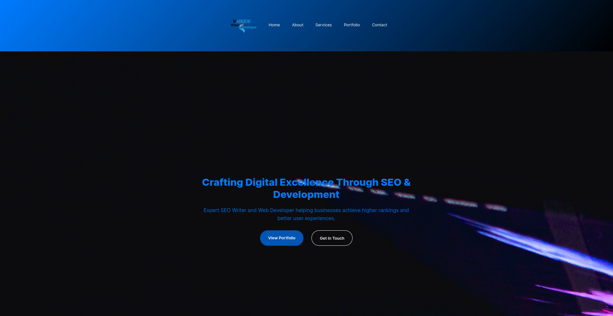
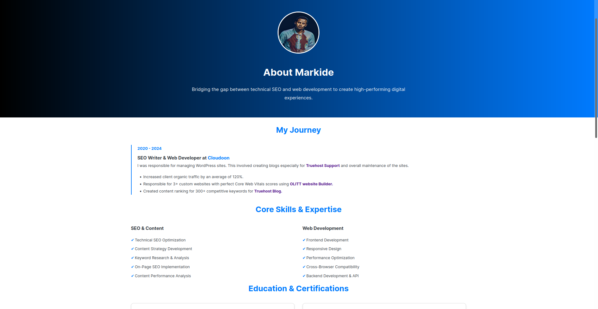
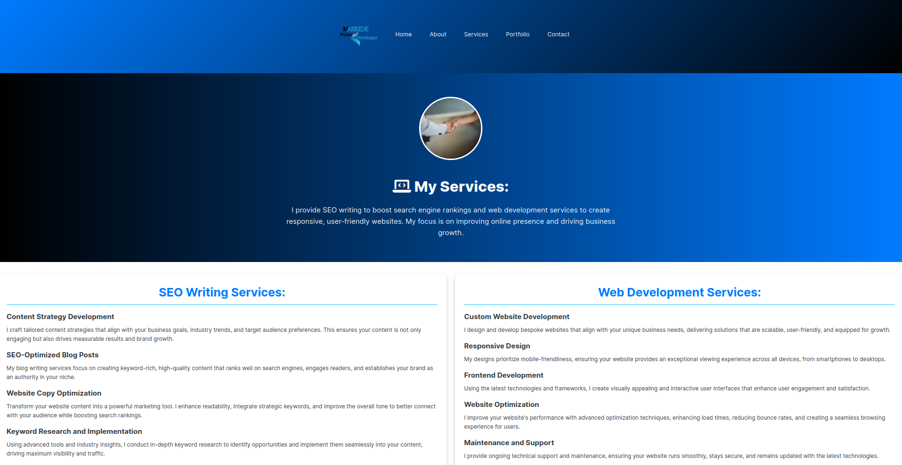
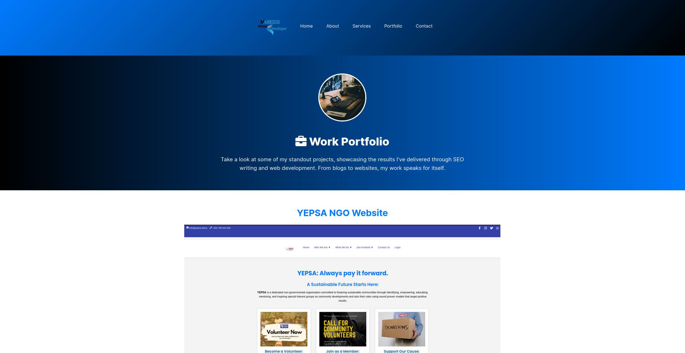
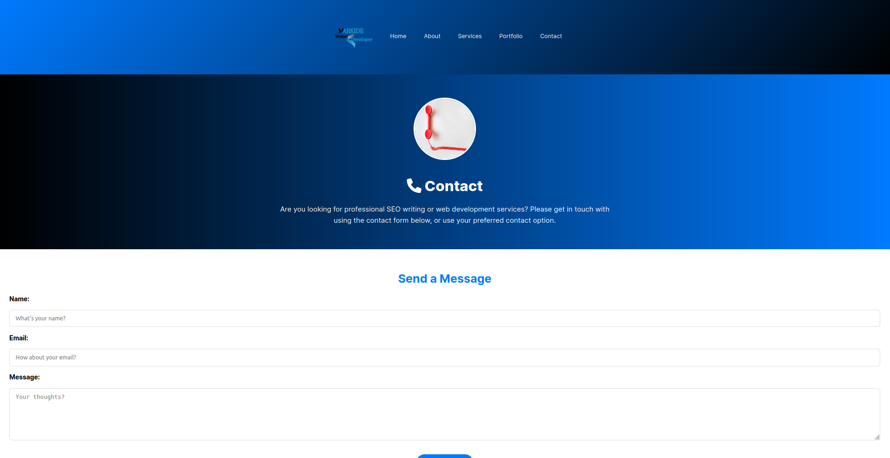

# Portfolio Version 2

Welcome to the second version of my portfolio! This project showcases my personal portfolio website, designed to highlight my skills, projects, and professional journey.

## Table of Contents:

- [Features](#features)
- [Project Structure](#project-structure)
- [Technologies Used](#technologies-used)
- [Screenshots](#screenshots)
- [Credits](#credits)
- [Notes](#notes)

---

## Features:

- **Dynamic Header and Footer**: Reusable components for consistency across pages.
- **Responsive Design**: Optimized for desktop and mobile devices.
- **Section Highlights**:
  - Home
  - About 
  - Services
  - Portfolio
  - Contact
- **Engaging Visuals**: Includes images and icons to enhance user experience.
- **SEO Optimized**: Structured content with proper meta tags for better visibility.

---

## Project Structure:

```plaintext
port v2/
├── components/
│   ├── footer.html
│   ├── header.html
├── css/
│   ├── about.css
│   ├── base.css
│   ├── components.css
│   ├── contact.css
│   ├── index.css
│   ├── portfolio.css
│   ├── services.css
├── images/
│   ├── blog.png
│   ├── call.jpg
│   ├── coding.jpg
│   ├── favicon.ico
│   ├── Logo.png
│   ├── m1.PNG
│   ├── port.png
│   ├── Pr.PNG
│   ├── qr.jpg
│   ├── SEO.jpg
│   ├── ser.jpg
│   ├── suv.jpg
│   ├── work.jpg
│   ├── yepsa.png
├── js/
│   ├── components.js
│   ├── contact.js
├── about.html
├── contact.html
├── index.html
├── portfolio.html
├── services.html

```
---
## Technologies Used:

  - HTML5: For structuring content.
  - CSS3: For styling and layout.
  - JavaScript: For interactive functionality.
  - Images: For visual enhancement.

--- 

## Screenshots:

### Homepage



### About Page



### Services Page



### Portfolio Page



### Contact Page


---
## Credits:

- Images: Courtesy of Unsplash and Pexels.
- Icons: Font Awesome.

---

### Notes:
- [GitHub Repo](https://github.com/Markide1/portv2)
- [Live site](https://markide.co.ke/)
